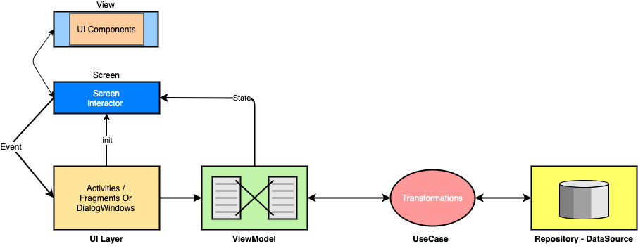

[![Contributors][contributors-shield]][contributors-url]
[![Forks][forks-shield]][forks-url]
[![Stargazers][stars-shield]][stars-url]
[![Issues][issues-shield]][issues-url]
[![MIT License][license-shield]][license-url]
[![LinkedIn][linkedin-shield]][linkedin-url]

<!-- PROJECT LOGO -->
 

  
  <h3 align="center">food app</h3>

  

    food Mobile App written in Kotlin and follows Clean Code architecture.
     
    <a href="/releases/">Get Sample app</a>
  

<!-- TABLE OF CONTENTS -->
## Table of Contents

* [About the Project](#about-the-project)
    * [Built With](#built-with)
* [Getting Started](#getting-started)
    * [Prerequisites](#prerequisites)
    * [Installation](#installation)
* [Roadmap](#roadmap)
* [Contributing](#contributing)
* [License](#license)
* [Contact](#contact)

<!-- ABOUT THE PROJECT -->
## About The Project

## food App 0.1
Welcome 👋 This repo is a showcase of an android application which uses Clean Architecture and manages states using a FSM(Finite state machine)

### Built With

* [Clean Arch](https://blog.cleancoder.com/uncle-bob/2012/08/13/the-clean-architecture.html)
* [RxJava3](https://github.com/ReactiveX/RxJava)
* [MVVM](https://bit.ly/2GmZICu)

### Architecture

#### Keywords
* Screen - Represents a layer to react to State presented by domain layer for UI to show or update UI elements
* State - State representation of a finite system based on business logic
* Event - Event representation for UI layer to react to in a finite approach.

<!-- GETTING STARTED -->
## Getting Started

Clone the project and review the code or simply download the apk.

### Prerequisites

Android Studio 4.2.1
Java 1.8

### Installation

1. Clone the repo
2. Clean build and then Run with Android Studio

<!-- ROADMAP -->
## Roadmap

See the [open issues](/Issues.md) for a list of proposed features (and known issues).

<!-- Tech docs -->
## Tech-stack

* Tech-stack
    * [Kotlin](https://kotlinlang.org/) - a cross-platform, statically typed, general-purpose programming language with type inference.
    * [RxJava 2](https://github.com/ReactiveX/RxJava) - perform background operations.
    * [Dagger Hilt](https://developer.android.com/training/dependency-injection/hilt-android) - a pragmatic lightweight dependency injection framework.
    * [Retrofit](https://square.github.io/retrofit/) - a type-safe REST client for Android.
    * [Jetpack](https://developer.android.com/jetpack)
        * [LiveData](https://developer.android.com/topic/libraries/architecture/livedata) - is an observable data holder.
        * [Lifecycle](https://developer.android.com/topic/libraries/architecture/lifecycle) - perform action when lifecycle state changes.
        * [ViewModel](https://developer.android.com/topic/libraries/architecture/viewmodel) - store and manage UI-related data in a lifecycle conscious way.
        * [Navigation](https://developer.android.com/guide/navigation) - Android navigation components helps connect different UI components
    * [Chucker](https://github.com/ChuckerTeam/chucker) - Netowrking debugging tool.
    * [Timber](https://github.com/JakeWharton/timber) - a highly extensible android logger.
    * [Andromeda](andromeda/) - a Design System module to help build components for UI layer

* Architecture
    * MVVM - Model View View Model
* Tests
    * [Unit Tests](https://en.wikipedia.org/wiki/Unit_testing) ([JUnit](https://junit.org/junit4/))
    * [Mockito](https://github.com/mockito/mockito) + [Mockito-Kotlin](https://github.com/nhaarman/mockito-kotlin)
* Gradle
    * [Kotlin DSL](https://docs.gradle.org/current/userguide/kotlin_dsl.html) - For reference purposes, here's an [article explaining the migration](https://medium.com/@evanschepsiror/migrating-to-kotlin-dsl-4ee0d6d5c977).
    * Plugins
        * [Json To Kotlin Data Class](https://github.com/Mighty16/JSONToKotlinClass) - Plugin generates Kotlin data classes from JSON text.

## Design Patterns
* [SOLID](https://en.wikipedia.org/wiki/SOLID) - SOLID principle
* [Design Principles](https://refactoring.guru/design-patterns) - Mostly Builder pattern

## Dependencies

All the dependencies (external libraries) are defined in the single place - Gradle [dependencies.gradle](dependencies.gradle) folder. This approach allows to easily manage dependencies and use the same dependency version across all modules.

<!-- CONTRIBUTING -->
## Contributing

Contributions are what make the open source community such an amazing place to be learn, inspire, and create. Any contributions you make are **greatly appreciated**.

1. Fork the Project
2. Create your Feature Branch (`git checkout -b feature/AmazingFeature`)
3. Commit your Changes (`git commit -m 'Add some AmazingFeature'`)
4. Push to the Branch (`git push origin feature/AmazingFeature`)
5. Open a Pull Request

<!-- LICENSE -->
## License

Distributed under the Apache License 2.0 License. See `LICENSE` for more information.